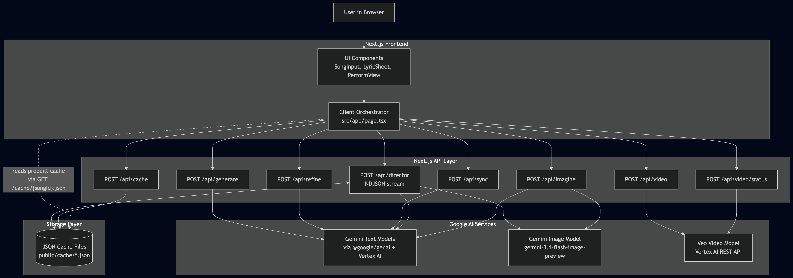

# Hearsay Lyrics

Edutainment across cultures.

AI-powered KTV companion that converts Mandarin lyrics into singable English "hearsay" lines and stages them as a shareable music-video experience, generating per-line visuals and short video clips that come together like a full music video.

## Inspiration

Inspired by short-form social videos and the user-generated "misheard lyrics" phenomenon. See the project brief in [docs/PRD.md](docs/PRD.md) for background and the hackathon framing.

## Pitch

A Gemini-powered web app that generates singable English "hearsay" lyrics for Mandarin songs, preserving syllable counts and rhythmic structure. It combines real-time audio sync, per-line personalization, and generative visuals to make foreign-language karaoke inclusive, fun, and shareable.

## Use Cases

- Karaoke inclusion: enable non-Chinese speakers to sing along at KTV nights.
- Live demos & events: showcase low-latency generation and sync for presentations and hackathons.
- Social content: create short-form, shareable lyric videos that resonate on social platforms.
- Language practice: pronunciation guides and incidental learning through singing.
- Fan engagement: localized, singable lyric experiences for international audiences.

## Current Capabilities

- Mandarin lyrics input (paste or demo catalog)
- Per-line hearsay generation with pinyin and meaning
- Personalization slider and per-line variants
- Inline editing, variant selection, and refine actions
- Audio input by URL or local upload with AI-generated timestamps
- Progressive NDJSON Director endpoint for streaming per-line updates
- Per-line generated image backdrops and slideshow mode
- Video clip generation flow (start + poll status)
- Cache-first demo mode for reproducible runs (`love-confession`)

## Interleaved Text + Image + Video Flow

1. Studio sends lyrics to `POST /api/director`.
2. Director returns NDJSON lines progressively, each containing lyric text fields and (when generated) image bytes.
 3. Perform mode overlays active lyric text over generated visual backdrops.
4. Optional slideshow uses per-line visual prompts/images.
5. Optional video flow starts via `POST /api/video` and polls `POST /api/video/status` until a clip is ready.

## Tech Stack

- Next.js App Router (TypeScript)
- React + Framer Motion
- Tailwind CSS
- Gemini models via `@google/genai`
- Vertex AI auth flow for Veo long-running video operations

## Architecture

High-level architecture and diagram: see [docs/architecture.md](docs/architecture.md).



## Prerequisites

- Node.js 20+
- pnpm 9+

## Environment Variables

Create `.env.local` in the repo root.

Required for text/image/sync flows:

```bash
VERTEX_AI_API_KEY=your_vertex_api_key
```

Required for video generation endpoints (`/api/video`, `/api/video/status`):

```bash
GCP_PROJECT_ID=your_gcp_project_id
GCP_SERVICE_ACCOUNT_JSON={"type":"service_account",...}
```

Notes:

- `GCP_SERVICE_ACCOUNT_JSON` must be valid JSON (single-line string in `.env.local`).
- If video credentials are missing, text/image features can still run.

## Run Locally

```bash
pnpm install
pnpm dev
```

Open http://localhost:3000

## Quick UI Repro (recommended)

Follow these steps to reproduce the core demo in the UI (fastest path):

1. Open the app at http://localhost:3000.
2. Select a catalog song (e.g., 告白氣球 — "Love Confession") from Hit Singles.
3. Keep the cache toggle ON (recommended for fast, demo-friendly runs).
4. Click "Direct MV" to generate per-line visuals and hearsay lyrics.
5. Wait for Studio output to appear, then switch to `Perform` mode.
6. Press Play — lyrics will highlight in sync with the visuals.
7. Use the Faithful ↔ Funny slider to change variants; tap Copy to share.

Optional: paste lyrics or upload audio to test any-song flows.

## Optional: Reproducible Testing (developer)

There is currently no dedicated unit/integration test runner in this repo. The tests below are optional developer checks you can run to validate build and deterministic director behavior.

### 1) Baseline Build + Lint

```bash
pnpm lint
pnpm build
```

Expected: both commands exit successfully.

### 2) Deterministic Cache-Backed Director Test (No Live Generation)

This verifies the interleaved director output path deterministically using cached assets.

```bash
curl -sS \
    -D /tmp/hearsay-headers.txt \
    -o /tmp/hearsay-cache.ndjson \
    -H "Content-Type: application/json" \
    -X POST http://localhost:3000/api/director \
    -d '{"text":"smoke","songId":"love-confession","cacheMode":"prefer-cache"}'

grep -i "X-Hearsay-Cache" /tmp/hearsay-headers.txt
wc -l /tmp/hearsay-cache.ndjson
rg '"hearsay"|"imageBase64"' /tmp/hearsay-cache.ndjson | head
```

Expected:

- Header includes `X-Hearsay-Cache: hit`
- NDJSON has multiple lines
- Output includes hearsay text fields and cached image payload fields

### 3) Live Interleaved Text+Image Director Test

This verifies real generation and progressive NDJSON content.

```bash
cat > /tmp/hearsay-live.json <<'JSON'
{
    "text": "塞納河畔 左岸的咖啡\n留下唇印的嘴\n告白氣球 風吹到對街",
    "cacheMode": "bypass-cache",
    "generateImages": true
}
JSON

curl -sS \
    -D /tmp/hearsay-live-headers.txt \
    -o /tmp/hearsay-live.ndjson \
    -H "Content-Type: application/json" \
    -X POST http://localhost:3000/api/director \
    --data-binary @/tmp/hearsay-live.json

grep -i "X-Hearsay-Cache" /tmp/hearsay-live-headers.txt
wc -l /tmp/hearsay-live.ndjson
rg '"hearsay"' /tmp/hearsay-live.ndjson
rg '"imageBase64"' /tmp/hearsay-live.ndjson
```

Expected:

- Header includes `X-Hearsay-Cache: bypassed`
- NDJSON contains generated line objects
- At least some lines include `imageBase64` unless image quota/rate-limit is hit

### 4) Video Generation API Test (Optional)

Requires `GCP_PROJECT_ID` + `GCP_SERVICE_ACCOUNT_JSON`.

Start operation:

```bash
curl -sS \
    -H "Content-Type: application/json" \
    -X POST http://localhost:3000/api/video \
    -d '{
        "lines": [
            {
                "chinese": "留下唇印的嘴",
                "pinyin": "Liú xià chún yìn de zuǐ",
                "meaning": "The mouth that left a lip print",
                "candidates": [{"text":"Lose ya shorn in the sway","phonetic":0.85,"humor":0.8}]
            }
        ]
    }'
```

Poll status using returned `operationName`:

```bash
curl -sS \
    -H "Content-Type: application/json" \
    -X POST http://localhost:3000/api/video/status \
    -d '{"operationName":"<paste-operation-name-here>"}'
```

Expected when complete:

- `done: true`
- one of `videoBase64` or `videoUri`

### 5) UI Repro Path

1. Open app at http://localhost:3000.
2. Select `告白氣球 (Love Confession)` from Hit Singles.
3. Keep cache toggle ON.
4. Click "Direct MV".
5. Confirm output appears in Studio, then switch to Perform.
6. Press Play and verify lyric progression + background visuals.

Expected:

 - Fast cache-backed run
 - Stable playback against `/audio/love-confession.mp3`
 - Interleaved lyric + visual experience in Perform mode

## Useful Docs

- Product plan: `docs/plan.md`
- PRD: `docs/PRD.md`
- UI revamp notes: `docs/UI_REVAMP_PLAN.md`
- Audio integration notes: `docs/audio-integration.md`
